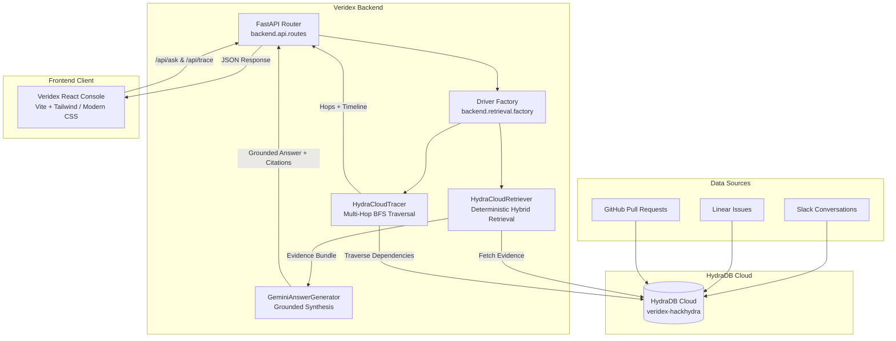

# Veridex — Evidence-First Dependency Intelligence

**Veridex** is an enterprise knowledge investigation system that reconstructs technical context across fragmented engineering sources using HydraDB's graph relationships, deterministic traversal, strict provenance preservation, and grounded synthesis.

> **HydraDB handles the deterministic graph reasoning. Gemini handles the language synthesis.**

---

## Problem

In modern engineering organizations, critical technical knowledge is fragmented across multiple siloed systems:
- **Slack**: Ephemeral incident discussions, triage decisions, on-call mitigations, and debug threads.
- **Linear**: Engineering task tracking, bug assignments, sprint priorities, and resolution status.
- **GitHub**: Pull requests, code review discussions, architectural guardrails, and release notes.

Traditional RAG architectures rely strictly on vector similarity to retrieve text chunks. While vector search can identify topically related passages, it cannot reliably establish the underlying relationships connecting incidents, pull requests, engineering tasks, technical components, and human decisions. This fundamental limitation leads to disconnected context and hallucinated entity linkages.

---

## What Veridex Does

Veridex unifies engineering signals into an evidence-first investigation pipeline:

```
[ Slack / Linear / GitHub ]
           │
           ▼
[ Canonical Records & Entity/Statement Nodes ]
           │
           ▼
[ HydraDB Cloud Graph Database ]
           │
           ▼
[ Deterministic Graph Retrieval & Multi-Hop Traversal ]
           │
           ▼
[ Bounded Evidence Bundle (Provenance Tracked: message_id + document_id) ]
           │
           ▼
[ Gemini Grounded Synthesis (Synthesis restricted to retrieved evidence) ]
           │
           ▼
[ Investigation Console (Rich Markdown Answer + Interactive Citations + Dependency Timeline) ]
```

1. **Source Signals**: Multi-source documents from Slack, Linear, and GitHub are structured into canonical entities, statements, and relationships.
2. **HydraDB Cloud Knowledge Graph**: Relationships are stored and indexed in HydraDB Cloud (`veridex-hackhydra`).
3. **Deterministic Retrieval & Traversal**: Given a question or technical entity, HydraDB queries the graph deterministically—retrieving explicit `MENTIONS`, `EXPRESSES`, and `ABOUT` connections.
4. **Bounded Evidence Bundle**: A strict evidence bundle carrying source document and message IDs (`dsid_<hex>`) is constructed.
5. **Grounded Synthesis**: Google Gemini synthesizes an answer **only** from the bounded evidence bundle. Gemini does not discover graph relationships or invent ungrounded facts.
6. **Provenance & Citation Inspection**: The user receives a structured, Markdown-rendered answer with interactive citation pills (`[E1, E2]`) linked directly to verifiable evidence cards.

---

## Why HydraDB

HydraDB is the foundational data and reasoning layer of Veridex:

- **Explicit Graph Topology**: Technical entities, incidents, and engineering statements are represented as first-class vertices and edges rather than flattened text embeddings.
- **Multi-Hop Traversal**: Enables discovering indirect dependencies and cascading failures across services and tools (e.g., Hop 1: `REL-311` → `api-search`; Hop 2: `api-search` → `v3.1.1-legacy-tokenizer`).
- **Deterministic Resolution**: Graph queries execute with exact relational guarantees, eliminating the probabilistic randomness and drift of pure vector search.
- **Unbroken Provenance**: Every retrieved edge and statement maintains its origin document ID and message vertex ID.
- **Relationship-Aware Investigation**: Distinguishes between `fact`, `action`, `decision`, `outcome`, and `claim` statement types.

### Concrete Example:
When diagnosing a production issue:
$$\text{Pull Request } (\text{PR-99501}) \longrightarrow \text{Linear Task } (\text{ENG-233901}) \longrightarrow \text{Service Component } (\text{KMS Guardrails}) \longrightarrow \text{Incident } (\text{INC-2026})$$

A pure vector search retrieves fragments mentioning "KMS" or "timeout" independently. HydraDB traverses the exact path between the code change, the tracking ticket, the mitigation statement, and the incident timeline.

---

## Track

**Hack Hydra 2026 — Track 1: Enterprise Context + Ontology**

### Demonstration Dataset:
The current demonstration uses a verified, controlled multi-source dataset slice of **60 documents** indexed in HydraDB Cloud (`veridex-hackhydra`):
- **20 Slack conversations** (#incidents, #eng-runtime, #eng-security)
- **20 Linear issues** (ENG-*, DES-*, INF-*)
- **20 GitHub pull requests** (PR-*)

---

## Architecture



---

## Core Features

- **Investigation / Ask Console**: Ask natural language engineering questions and receive evidence-backed, Markdown-formatted answers.
- **Deterministic Graph Retrieval**: Queries HydraDB Cloud with keyword, entity, and relation constraints.
- **Multi-Hop Dependency Tracing**: Interactively traverse 1-hop, 2-hop, or full dependency networks starting from any entity or ticket.
- **Entity Explorer**: Browse all indexed technical components, tickets, and tools with one-click **Ask About This** and **Trace Connections** actions.
- **Interactive Citation Pills**: Click citations (`[E1, E2]`) to smoothly scroll and highlight the exact underlying evidence card.
- **Bounded Evidence Bundle**: Inspect the full raw text, message ID, document ID, and statement classification for every claim.
- **Insufficient-Evidence Handling**: Explicitly flags when the knowledge graph contains partial or no information, preventing hallucination.
- **Zero-Auto-Execution Navigation**: Prevents accidental queries when navigating between views.
- **HydraDB Cloud Telemetry**: Real-time status reporting (`HYDRADB CLOUD  CONNECTED`).

---

## Getting Started

### Prerequisites
- **Python**: `3.11+`
- **Node.js**: `20.12+`
- **npm**: `10+`

### 1. Environment Setup

Clone the repository and create your local `.env` configuration:

```bash
cp .env.example .env
```

Configure your server-side environment variables in `.env`:

```env
HYDRA_MODE=cloud
HYDRA_DB_DATABASE=veridex-hackhydra
HYDRA_DB_BASE_URL=https://api.hydradb.com
HYDRA_DB_API_KEY=<your-hydradb-cloud-api-key>

GEMINI_API_KEY=<your-gemini-api-key>
GEMINI_MODEL=gemini-3.6-flash
PORT=8000
```

> [!NOTE]
> `HYDRA_DB_API_KEY` and `GEMINI_API_KEY` are server-side secrets. They are never exposed to the frontend or bundled into client builds.

### 2. Backend Setup

Install Python dependencies and start the FastAPI server:

```bash
pip install -r requirements.txt
python -m uvicorn backend.api.app:app --reload --port 8000
```

The backend server will start at `http://localhost:8000`.

### 3. Frontend Setup

In a separate terminal, install dependencies and start the Vite development server:

```bash
cd frontend-react
npm install
npm run dev
```

Open your browser at **`http://localhost:5173`**.

---

## Production Deployment (Render)

Veridex includes a tested [`render.yaml`](render.yaml) blueprint for deploying as a single unified web service:

- **Build Command**:
  ```bash
  npm install --prefix frontend-react && npm run build --prefix frontend-react && pip install -r requirements.txt
  ```
- **Start Command**:
  ```bash
  uvicorn backend.api.app:app --host 0.0.0.0 --port $PORT
  ```
- **Health Check Path**: `/api/health`

---

## Verification & Testing

Veridex includes a comprehensive, 100% offline-capable test suite:

### 1. Run Python Unit & Integration Tests
```bash
python -m pytest -q
```
*Result: **153 passed**.*

### 2. Run Frontend SSR & Workflow Tests
```bash
npm test --prefix frontend-react
```
*Result: **All SSR, component, and zero-auto-execution navigation tests passed**.*

### 3. Run Frontend Production Build
```bash
npm run build --prefix frontend-react
```
*Result: **Clean production build in `frontend-react/dist`**.*

### 4. Run Production Smoke Test Suite
```bash
python backend/verify_production_smoke.py --in-process
```
*Result: **All health, retrieval, trace, and secret isolation checks passed**.*

---

## Project Structure

```
deptrace/
├── backend/
│   ├── api/
│   │   ├── app.py                      # FastAPI application setup & static asset serving
│   │   └── routes.py                   # /api/health, /api/ask, /api/trace, /api/trace/entities
│   ├── config.py                       # AppConfig, HYDRA_MODE, and secret validation
│   ├── rag/
│   │   ├── generator.py                # GeminiAnswerGenerator with bounded prompt engineering
│   │   └── models.py                   # Pydantic schemas for questions, answers, and evidence
│   ├── retrieval/
│   │   ├── cloud_retriever.py          # HydraCloudRetriever (HydraDB Cloud v2 API driver)
│   │   ├── cloud_tracer.py             # HydraCloudTracer (Multi-hop dependency graph BFS)
│   │   ├── factory.py                  # Active driver factory (HydraCloudRetriever / Tracer)
│   │   └── models.py                   # EvidenceItem, TraceHop, ImpactSummary data models
│   └── verify_production_smoke.py      # Automated production deployment smoke test runner
├── frontend-react/
│   ├── src/
│   │   ├── components/
│   │   │   ├── InvestigationView.jsx   # Ask console with Markdown rendering & citation pills
│   │   │   ├── TraceView.jsx           # Dependency trace visualization with timeline
│   │   │   ├── EntityExplorer.jsx      # Technical entity catalog with contextual actions
│   │   │   ├── SuggestionsView.jsx     # Grounded suggestion cards categorized by source
│   │   │   ├── WhyHydraDB.jsx          # Interactive architecture breakdown
│   │   │   ├── GraphHealth.jsx         # Live HydraDB Cloud connection telemetry
│   │   │   ├── LandingPage.jsx         # Product overview & workflow guide
│   │   │   └── Sidebar.jsx             # Navigation sidebar with status indicator
│   │   ├── data/
│   │   │   └── suggestions.js          # Verified 17-question Cloud suggestion catalog
│   │   ├── utils/
│   │   │   └── hydraStatus.js          # Telemetry formatting helpers
│   │   ├── App.jsx                     # Root application shell & navigation router
│   │   ├── main.jsx                    # React 19 entrypoint
│   │   └── index.css                   # Responsive design system & typography
│   ├── test_render.js                  # SSR & interaction test runner
│   └── vite.config.js                  # Vite bundler & API proxy configuration
├── tests/
│   ├── test_api.py                     # Offline API route integration tests
│   └── test_production_readiness.py    # Configuration, secret isolation, & driver unit tests
├── .env.example                        # Template for environment configuration
├── render.yaml                         # Render deployment specification
├── requirements.txt                    # Python backend dependencies
├── LICENSE                             # MIT Open-Source License
└── README.md                           # Project documentation
```

---

## HydraDB Usage & Technical Deep Dive

### Where HydraDB Is Used in the Codebase:
1. **[`backend/retrieval/cloud_retriever.py`](backend/retrieval/cloud_retriever.py)**:
   - `HydraCloudRetriever.retrieve()`: Performs hybrid search over HydraDB Cloud v2 (`/v2/databases/{db}/query`), executing relation bindings and thinking mode over graph entities (`[:MENTIONS]`, `[:EXPRESSES]`, `[:ABOUT]`).
2. **[`backend/retrieval/cloud_tracer.py`](backend/retrieval/cloud_tracer.py)**:
   - `HydraCloudTracer.trace()`: Performs multi-hop BFS graph traversal across technical entity vertices, returning dependency hops, linked components, and chronological statement timelines.
   - `HydraCloudTracer.get_available_entities()`: Discovers available graph entities indexed in the database.
3. **[`backend/retrieval/factory.py`](backend/retrieval/factory.py)**:
   - Manages active driver lifecycle and connection health checks against HydraDB Cloud.

### What Veridex Would Lose Without HydraDB:
Without HydraDB, Veridex would be forced to rely on standard vector similarity chunk retrieval. This would cause:
1. **Loss of Relational Grounding**: Inability to determine whether PR-99501 caused an incident or mitigated it.
2. **Loss of Multi-Hop Dependency Discovery**: Inability to trace indirect linkages between components and upstream services.
3. **Hallucinated Syntheses**: Without bounded graph evidence bundles, language models hallucinate plausible-sounding but false linkages.
4. **Loss of Structural Provenance**: Vector chunks discard vertex-level message and document lineage.

---

## Dataset & Provenance

- **Size**: 60 multi-source documents.
- **Coverage**: Slack triage channels, Linear engineering issues, GitHub pull requests.
- **Integrity**: Frozen dataset indexed directly in HydraDB Cloud (`veridex-hackhydra`).
- **Idempotent Identifiers**: All vertex IDs are derived deterministically from stable source document identifiers (`dsid_<hex>`).

---

## Security

- **Strict Secret Isolation**: `HYDRA_DB_API_KEY` and `GEMINI_API_KEY` are read strictly server-side in Python.
- **Frontend Protection**: Zero secrets are passed to Vite or exposed in frontend client bundles.
- **Git Protection**: `.env` is explicitly git-ignored.

---

## License

This project is licensed under the **MIT License** — see the [LICENSE](LICENSE) file for details.

---

## Acknowledgements & Attribution

- **[HydraDB](https://github.com/hydra-db/hydradb)**: Next-generation graph-relational database powering deterministic knowledge retrieval.
- **[FastAPI](https://fastapi.tiangolo.com/)**: High-performance Python web framework.
- **[Google Gemini](https://ai.google.dev/)**: Language model API for grounded synthesis.
- **[React](https://react.dev/) & [Vite](https://vite.dev/)**: Modern frontend client tooling.

---

## Hack Hydra

Built for **Hack Hydra 2026 — Track 1: Enterprise Context + Ontology**.
